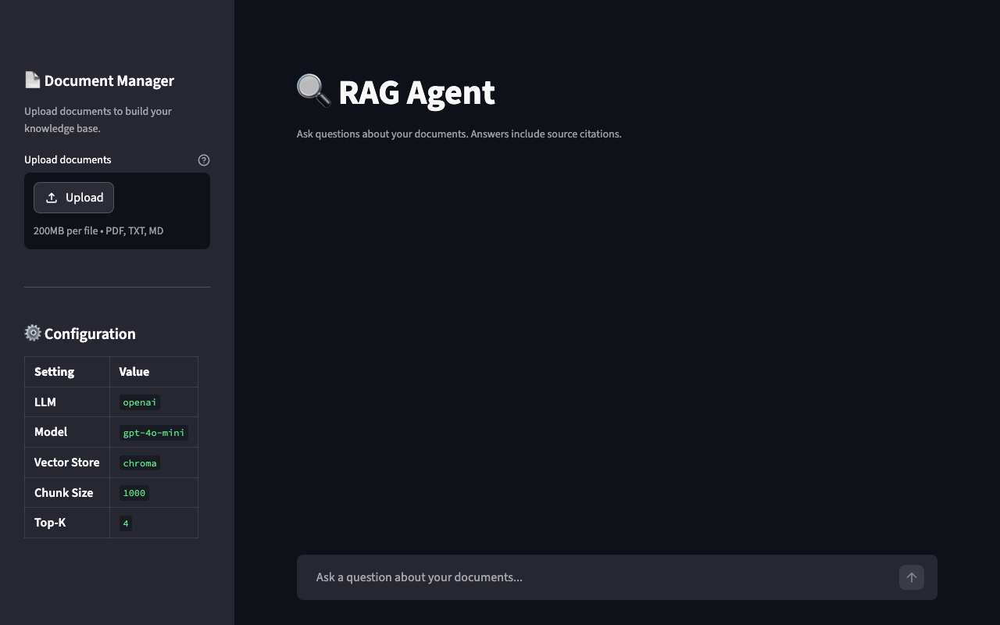

# 🔍 RAG Agent

A production-quality **Retrieval-Augmented Generation** agent that lets you upload documents and ask questions with source-cited answers. Built with LangChain, ChromaDB, and Streamlit.

[](https://www.python.org/downloads/)
[](https://python.langchain.com/)
[](LICENSE)

## Demo



---

## ✨ Features

- **📄 Multi-format document ingestion** — PDF, TXT, and Markdown
- **🧠 Intelligent chunking** — Recursive text splitting with configurable size and overlap
- **🔎 Semantic search** — Vector similarity retrieval via ChromaDB or FAISS
- **💬 Conversational UI** — Clean Streamlit chat interface with message history
- **📚 Source citations** — Every answer references the exact documents and pages used
- **🔌 Pluggable LLM** — Switch between OpenAI, Anthropic, or Ollama with one env var
- **🐳 Dockerized** — One command to build and run

## 🏗️ Architecture

```
┌─────────────┐     ┌──────────────┐     ┌─────────────────┐
│  Streamlit   │────▶│   Ingestion  │────▶│   Vector Store  │
│     UI       │     │   Pipeline   │     │  (ChromaDB /    │
│              │     │              │     │   FAISS)        │
│  Upload &    │     │  Load ──▶    │     │                 │
│  Chat        │     │  Split ──▶   │     │  Embeddings     │
│              │     │  Embed ──▶   │     │  stored here    │
└──────┬───────┘     │  Index       │     └────────┬────────┘
       │             └──────────────┘              │
       │                                           │
       │  Question                                 │  Retrieval
       ▼                                           ▼
┌──────────────┐     ┌──────────────┐     ┌─────────────────┐
│   RAG Chain  │────▶│     LLM      │────▶│    Response +   │
│              │     │  (OpenAI /   │     │    Source        │
│  Prompt +    │     │  Anthropic / │     │    Citations     │
│  Context     │     │  Ollama)     │     │                 │
└──────────────┘     └──────────────┘     └─────────────────┘
```

## 🚀 Quick Start

### Prerequisites
- Python 3.12+
- An LLM API key (OpenAI, Anthropic, or local Ollama)
- **No API key needed for embeddings** — uses local HuggingFace model by default

### 1. Clone & Install

```bash
git clone https://github.com/bludragon-ai/rag-agent.git
cd rag-agent

python -m venv venv
source venv/bin/activate  # Windows: venv\Scripts\activate

pip install -r requirements.txt
```

### 2. Configure

```bash
cp .env.example .env
# Edit .env and add your API key
```

### 3. Run

```bash
make run
# or: streamlit run src/ui/app.py
```

Open [http://localhost:8501](http://localhost:8501) in your browser.

### 4. Try It

1. Upload the sample documents from `docs/sample/`
2. Click **Index Documents**
3. Ask: *"What is RAG and how does it work?"*

## 🐳 Docker

```bash
# Build and run
cp .env.example .env  # configure your API key
docker compose up --build

# Access at http://localhost:8501
```

## 🔧 Configuration

All settings are controlled via environment variables (see [`.env.example`](.env.example)):

| Variable | Default | Description |
|----------|---------|-------------|
| `LLM_PROVIDER` | `openai` | LLM backend: `openai`, `anthropic`, `ollama` |
| `OPENAI_API_KEY` | — | Your OpenAI API key |
| `OPENAI_MODEL` | `gpt-4o-mini` | OpenAI model to use |
| `EMBEDDING_PROVIDER` | `huggingface` | Embedding backend: `huggingface` (local) or `openai` |
| `EMBEDDING_MODEL` | `all-MiniLM-L6-v2` | Embedding model name |
| `VECTOR_STORE` | `chroma` | Vector store: `chroma` or `faiss` |
| `CHUNK_SIZE` | `1000` | Document chunk size (characters) |
| `CHUNK_OVERLAP` | `200` | Overlap between chunks |
| `RETRIEVAL_TOP_K` | `4` | Number of chunks retrieved per query |

### Using with Anthropic (no OpenAI key needed)

```bash
# Set in .env:
LLM_PROVIDER=anthropic
ANTHROPIC_API_KEY=sk-ant-your-key-here
# Embeddings use local HuggingFace by default — no extra API key needed!
```

### Using with Ollama (fully local, no API key needed)

```bash
# Install Ollama: https://ollama.ai
ollama pull llama3

# Set in .env:
LLM_PROVIDER=ollama
OLLAMA_MODEL=llama3
# Embeddings use local HuggingFace by default — fully local, no API keys!
```

## 📁 Project Structure

```
rag-agent/
├── src/
│   ├── core/
│   │   ├── config.py        # Centralized settings (pydantic-settings)
│   │   ├── llm.py           # LLM factory (OpenAI / Anthropic / Ollama)
│   │   ├── embeddings.py    # Embedding model factory
│   │   ├── vectorstore.py   # Vector store factory (Chroma / FAISS)
│   │   ├── ingest.py        # Document loading & chunking pipeline
│   │   └── chain.py         # RAG chain with LCEL
│   ├── ui/
│   │   └── app.py           # Streamlit web interface
│   └── utils/
│       └── logging.py       # Logging configuration
├── tests/                   # Unit tests
├── docs/sample/             # Sample documents for demo
├── Dockerfile
├── docker-compose.yml
├── requirements.txt
├── Makefile
└── .env.example
```

## 🧪 Testing

```bash
make test
# or: pytest tests/ -v
```

## 🛣️ Roadmap

- [ ] Conversation memory (multi-turn context)
- [ ] Hybrid search (keyword + semantic)
- [ ] Document management UI (view/delete indexed docs)
- [ ] Streaming responses
- [ ] Authentication & multi-user support
- [ ] API endpoint (FastAPI) alongside the UI

## 📄 License

MIT — see [LICENSE](LICENSE) for details.

---

Built by [bludragon-ai](https://github.com/bludragon-ai)
